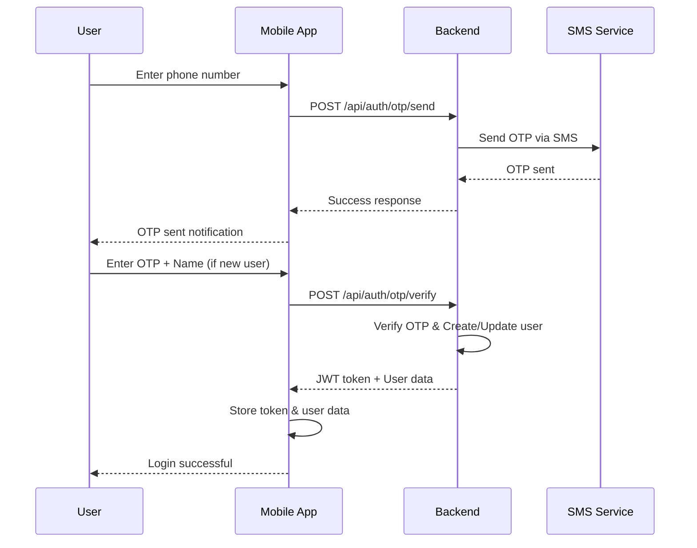
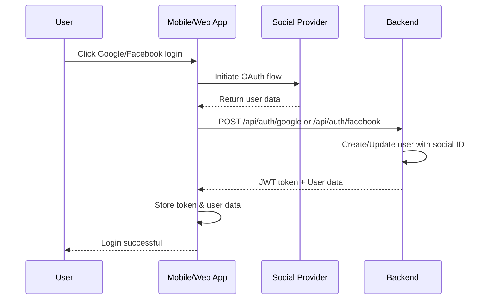

# Pashu Marketplace - Authentication & User Management System

## 🚀 Overview

This document outlines the comprehensive authentication and user management system implemented for the Pashu Marketplace application. The system supports multiple authentication methods including OTP-based mobile authentication, social login (Google & Facebook), and traditional email/password authentication.

## 📋 Features Implemented

### ✅ Authentication Methods
- **Mobile OTP Authentication**: Send/verify OTP via SMS
- **Social Login**: Google and Facebook OAuth integration
- **Email/Password**: Traditional authentication
- **JWT-based Session Management**: Secure token-based authentication

### ✅ User Management
- **Profile Management**: Complete user profile with KYC, farm address, GST details
- **Profile Picture Upload**: Image upload with validation
- **Settings Management**: Notifications, privacy, language, theme preferences
- **Account Deletion**: Soft delete with data preservation

### ✅ Database Models
- **User Model**: Enhanced with social IDs, profile picture, farm address, GST
- **OtpSession Model**: OTP verification with expiry and attempt limits
- **Settings Model**: User preferences and privacy settings

## 🏗️ Architecture

### Backend (Next.js API Routes)
```
backend/
├── pages/api/
│   ├── auth/
│   │   ├── otp/
│   │   │   ├── send.ts          # Send OTP to mobile
│   │   │   └── verify.ts        # Verify OTP and login/register
│   │   ├── google.ts            # Google OAuth login
│   │   ├── facebook.ts          # Facebook OAuth login
│   │   └── logout.ts            # Logout endpoint
│   ├── user/
│   │   ├── me.ts                # Get current user profile
│   │   ├── update.ts            # Update user profile
│   │   ├── upload-profile-pic.ts # Upload profile picture
│   │   └── delete.ts            # Delete account
│   └── settings/
│       ├── index.ts             # Get user settings
│       └── update.ts            # Update user settings
├── models/
│   └── index.js                 # MongoDB models (User, OtpSession, Settings)
└── lib/
    ├── auth.js                  # Authentication middleware
    └── jwt.js                   # JWT utilities
```

### Frontend Applications

#### Mobile App (React Native)
```
mobile/src/
├── screens/auth/
│   ├── LoginScreen.tsx          # Phone number input
│   ├── OTPScreen.tsx            # OTP verification
│   └── SocialLoginScreen.tsx    # Social login options
├── screens/
│   ├── ProfileScreen.tsx        # User profile management
│   └── SettingsScreen.tsx       # App settings
├── context/
│   └── AuthContext.tsx          # Authentication context
└── api/
    └── auth.ts                  # Authentication API calls
```

#### Web App (Next.js)
```
web-frontend/src/app/
├── login/
│   └── page.tsx                 # Comprehensive login page
├── profile/
│   └── page.tsx                 # Profile management
└── settings/
    └── page.tsx                 # Settings management
```

## 🔐 Authentication Flow

### 1. Mobile OTP Authentication



### 2. Social Login Flow



## 📱 API Endpoints

### Authentication Endpoints

| Method | Endpoint | Description | Auth Required |
|--------|----------|-------------|---------------|
| POST | `/api/auth/otp/send` | Send OTP to mobile number | No |
| POST | `/api/auth/otp/verify` | Verify OTP and login/register | No |
| POST | `/api/auth/google` | Google OAuth login | No |
| POST | `/api/auth/facebook` | Facebook OAuth login | No |
| POST | `/api/auth/logout` | Logout user | Yes |

### User Management Endpoints

| Method | Endpoint | Description | Auth Required |
|--------|----------|-------------|---------------|
| GET | `/api/user/me` | Get current user profile | Yes |
| PATCH | `/api/user/update` | Update user profile | Yes |
| POST | `/api/user/upload-profile-pic` | Upload profile picture | Yes |
| DELETE | `/api/user/delete` | Delete user account | Yes |

### Settings Endpoints

| Method | Endpoint | Description | Auth Required |
|--------|----------|-------------|---------------|
| GET | `/api/settings` | Get user settings | Yes |
| PATCH | `/api/settings/update` | Update user settings | Yes |

## 🗄️ Database Schema

### User Model
```javascript
{
  _id: ObjectId,
  role: String, // 'buyer', 'seller', 'service', 'admin'
  name: String,
  mobile: String, // Required, unique
  email: String, // Optional, unique with sparse index
  passwordHash: String, // Optional for OTP-only users
  profilePic: String, // URL to profile picture
  kyc: {
    aadhaar: String,
    pan: String,
    verified: Boolean
  },
  farmAddress: {
    street: String,
    city: String,
    state: String,
    pincode: String,
    country: String
  },
  gst: String,
  rating: Number,
  location: {
    state: String,
    district: String,
    pincode: String,
    lat: Number,
    lng: Number
  },
  languages: [String],
  socialIds: {
    googleId: String,
    facebookId: String
  },
  isActive: Boolean,
  lastLogin: Date,
  createdAt: Date,
  updatedAt: Date
}
```

### OtpSession Model
```javascript
{
  _id: ObjectId,
  mobile: String,
  otp: String,
  expiresAt: Date, // 10 minutes from creation
  verified: Boolean,
  attempts: Number, // Max 3 attempts
  createdAt: Date,
  updatedAt: Date
}
```

### Settings Model
```javascript
{
  _id: ObjectId,
  userId: ObjectId, // Reference to User
  notifications: {
    email: Boolean,
    sms: Boolean,
    push: Boolean,
    marketing: Boolean
  },
  language: String, // 'en', 'hi', 'te', etc.
  privacy: {
    showPhone: Boolean,
    showLocation: Boolean,
    showEmail: Boolean
  },
  theme: String, // 'light', 'dark', 'auto'
  createdAt: Date,
  updatedAt: Date
}
```

## 🔧 Environment Configuration

### Backend Environment Variables
```bash
# Database
DATABASE_URL=mongodb://localhost:27017/pashu-marketplace

# JWT Configuration
JWT_SECRET=your-jwt-secret-key-here
JWT_EXPIRES_IN=7d

# OAuth Configuration
GOOGLE_CLIENT_ID=your-google-client-id
GOOGLE_CLIENT_SECRET=your-google-client-secret
FACEBOOK_APP_ID=your-facebook-app-id
FACEBOOK_APP_SECRET=your-facebook-app-secret

# SMS Configuration
TWILIO_ACCOUNT_SID=your-twilio-account-sid
TWILIO_AUTH_TOKEN=your-twilio-auth-token
TWILIO_PHONE_NUMBER=+1234567890

# File Upload
PROFILE_PIC_MAX_SIZE=5242880
PROFILE_PIC_ALLOWED_TYPES=image/jpeg,image/png,image/gif,image/webp
```

## 🚀 Getting Started

### 1. Backend Setup
```bash
cd backend
npm install
cp env.example .env
# Configure environment variables
npm run dev
```

### 2. Mobile App Setup
```bash
cd mobile
npm install
npx expo start
```

### 3. Web App Setup
```bash
cd web-frontend
npm install
npm run dev
```

## 📱 Mobile App Usage

### Authentication Screens
1. **Login Screen**: Enter phone number or choose email login
2. **OTP Screen**: Enter 6-digit OTP received via SMS
3. **Social Login Screen**: Choose Google or Facebook login

### Profile Management
1. **Profile Screen**: View and edit user profile
2. **Settings Screen**: Manage app preferences and privacy settings

## 🌐 Web App Usage

### Login Page Features
- **Phone Login**: Enter phone number → Receive OTP → Verify
- **Email Login**: Traditional email/password authentication
- **Social Login**: One-click Google/Facebook authentication
- **OTP Verification**: Real-time OTP input with resend functionality

## 🔒 Security Features

### Authentication Security
- **JWT Tokens**: Secure token-based authentication
- **OTP Expiry**: 10-minute OTP validity
- **Attempt Limits**: Maximum 3 OTP verification attempts
- **Password Hashing**: bcryptjs for password security

### Data Protection
- **Input Validation**: Comprehensive input validation
- **File Upload Security**: Image type and size validation
- **Privacy Controls**: User-controlled data visibility
- **Soft Delete**: Account deletion preserves data integrity

## 🧪 Testing

### API Testing
```bash
# Test OTP send
curl -X POST http://localhost:5001/api/auth/otp/send \
  -H "Content-Type: application/json" \
  -d '{"mobile": "9876543210"}'

# Test OTP verify
curl -X POST http://localhost:5001/api/auth/otp/verify \
  -H "Content-Type: application/json" \
  -d '{"mobile": "9876543210", "otp": "123456", "name": "Test User"}'
```

### Mobile App Testing
1. Install Expo Go app
2. Scan QR code from `npx expo start`
3. Test authentication flows
4. Test profile and settings functionality

## 📈 Future Enhancements

### Planned Features
- [ ] **Biometric Authentication**: Fingerprint/Face ID support
- [ ] **Two-Factor Authentication**: Enhanced security
- [ ] **Account Recovery**: Phone/email-based recovery
- [ ] **Advanced KYC**: Document verification integration
- [ ] **Multi-language Support**: Regional language support
- [ ] **Push Notifications**: Real-time notifications
- [ ] **Analytics**: User behavior tracking
- [ ] **Admin Panel**: User management dashboard

## 🐛 Troubleshooting

### Common Issues

1. **OTP Not Received**
   - Check phone number format
   - Verify SMS service configuration
   - Check Twilio account status

2. **Social Login Fails**
   - Verify OAuth app configuration
   - Check redirect URLs
   - Ensure proper API keys

3. **Profile Upload Issues**
   - Check file size limits
   - Verify image format
   - Ensure proper permissions

### Debug Mode
Enable debug logging by setting `NODE_ENV=development` in your environment variables.

## 📞 Support

For technical support or questions about the authentication system:
- Create an issue in the repository
- Contact the development team
- Check the API documentation

---

**Last Updated**: December 2024  
**Version**: 1.0.0  
**Status**: Production Ready ✅
