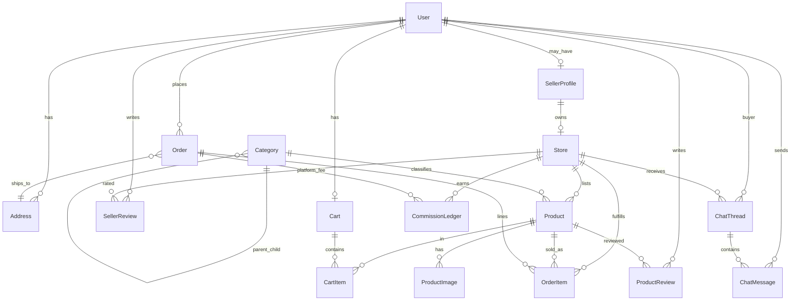

# Entity relationship (from Prisma schema)

High-level model: **User** (buyer/seller/admin) owns **Address** and **Cart**; **SellerProfile** + **Store** own **Product**; **Order** snapshots address and line items per **Store**; **Reviews**, **Chat**, **AgriEvent**, and **CommissionLedger** support marketplace operations.

Enums (status fields): `Role`, `SellerKycStatus`, `ProductStatus`, `OrderStatus`, `PaymentStatus`.
